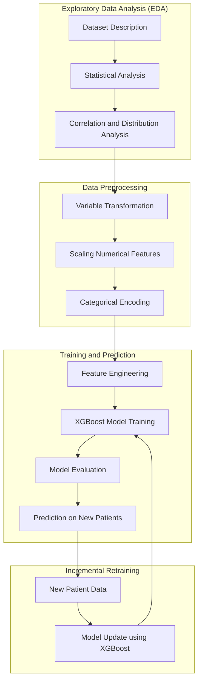

#  An Intelligent Alzheimer’s Risk Prediction System Based on XGBoost and Continuous Learning

## Abstract

Alzheimer’s disease represents a major global health challenge due to its progressive nature and the difficulty of early detection. This work presents an intelligent Alzheimer’s risk prediction system based on supervised machine learning, designed to estimate the probability of Alzheimer’s disease using clinical, demographic, lifestyle, and cognitive assessment data. The proposed system integrates an XGBoost classifier with a complete data science pipeline that includes exploratory data analysis, feature engineering, model training, evaluation, and continuous retraining. Model tracking and versioning are handled using MLflow, while real-time inference is enabled through a FastAPI-based REST service and a web interface. Experimental results demonstrate that the proposed approach provides reliable risk estimations and supports continuous improvement through incremental retraining. Future work includes incorporating additional medical data sources and exploring hybrid models that combine machine learning with expert knowledge.

## 2. Technologies and Tools

- **Machine Learning & Data Science:** Python, Pandas, NumPy, Scikit-learn, XGBoost, MLflow  
- **Backend:** FastAPI, Uvicorn  
- **Frontend:** HTML, JavaScript, CSS  
- **Visualization:** Matplotlib, Seaborn, Plotly  

## 3. Proposed Methodology

The proposed methodology follows a phased machine learning approach aligned with the notebooks developed in this work. First, an exploratory data analysis (EDA) stage is performed to understand the characteristics of the dataset, including statistical distributions and correlations among clinical, demographic, lifestyle, and cognitive variables.

In the second phase, data preprocessing and variable transformation are applied. This includes handling missing values, scaling numerical features, and encoding categorical variables to ensure compatibility with machine learning algorithms.

The third phase integrates feature engineering and supervised learning. Domain-driven features are constructed and an XGBoost classifier is trained and evaluated using standard classification metrics. The trained model is then used to generate risk predictions for new patients.

Finally, the system incorporates an incremental retraining phase, where newly collected and manually reviewed patient data are used to update the model. This allows continuous learning while preserving previously acquired knowledge.

**Figure 1. Phased methodology of the proposed Alzheimer’s risk prediction system.**

## 4. Experimental Design

### 4.1 Dataset Characteristics

The dataset consists of structured medical data collected from **2,149 patients**, designed for Alzheimer’s disease risk prediction. The data include multiple categories of variables that describe demographic, clinical, lifestyle, and cognitive aspects of each patient.

The main categories are:

- **Demographic information:** age, gender, ethnicity, and education level  
- **Medical history and comorbidities**  
- **Lifestyle factors:** smoking habits, alcohol consumption, and physical activity  
- **Clinical measurements:** blood pressure and cholesterol levels  
- **Cognitive and functional assessments:** MMSE and functional evaluation scores  
- **Symptom indicators** related to Alzheimer’s disease  

These variables are represented as structured tabular data and are suitable for supervised machine learning models such as XGBoost.

---

### 4.2 Model Parameters

The predictive model used in this work is an **XGBoost Classifier**, selected for its strong performance on structured medical data. The model was configured using the parameters shown in Table 1.

**Table 1. XGBoost Model Parameters**

| Parameter        | Value |
|------------------|-------|
| Algorithm        | XGBoost Classifier |
| n_estimators     | 100 |
| learning_rate    | 0.05 |
| max_depth        | 5 |
| eval_metric      | logloss |
| random_state     | 42 |

## 5. Results and Discussion

The experimental results obtained from the developed notebooks demonstrate that the proposed **XGBoost-based model** achieves solid and consistent performance for Alzheimer’s disease risk prediction using structured medical data. Exploratory data analysis revealed meaningful relationships between cognitive assessments, clinical measurements, and Alzheimer-related outcomes, supporting the relevance of the selected variables.

The preprocessing and feature transformation stages ensured data consistency and stability during training. Feature engineering played a key role in improving predictive performance, particularly through the incorporation of cognitive indicators, lifestyle-related variables, and clinical risk factors.

Model training with XGBoost showed reliable convergence and good generalization on unseen data. The best-performing model was trained and registered using **MLflow**, enabling experiment tracking, reproducibility, and comparison between model versions.

**Figure 2. Confusion matrix for Alzheimer’s disease risk prediction using XGBoost.**

The confusion matrix shows that the model correctly classified **270 non-Alzheimer cases** and **138 Alzheimer cases**, with a limited number of misclassifications (**8 false positives** and **14 false negatives**). This indicates a well-balanced trade-off between precision and sensitivity, which is especially important in medical risk estimation tasks.

### Best Model Hyperparameters

| Parameter        | Value |
|------------------|-------|
| n_estimators     | 200 |
| learning_rate    | 0.1 |
| max_depth        | 5 |
| subsample        | 0.8 |
| colsample_bytree | 0.8 |

### Evaluation Metrics

| Metric     | Value |
|------------|-------|
| Accuracy   | 0.9419 |
| Precision  | 0.9395 |
| Recall     | 0.9327 |
| F1-score   | 0.9359 |

The prediction notebook demonstrated the practical applicability of the model by generating risk estimations for new patient data. Additionally, the incremental retraining notebook validated the system’s capability to incorporate newly labeled cases, allowing continuous improvement while preserving previously learned patterns.

Overall, the results confirm that the proposed methodology is suitable for real-time risk estimation and continuous learning in a clinical decision-support context.

---

## 6. Conclusions

This paper presents a comprehensive and structured machine learning project for predicting the risk of Alzheimer's disease, fully aligned with the data science lifecycle. The proposed phased methodology integrates exploratory data analysis, data preprocessing, feature engineering, supervised learning with XGBoost, prediction on new patient data, and incremental retraining, resulting in a coherent and reproducible solution.

The experimental results confirm that XGBoost is an effective algorithm for handling structured medical data, providing strong and well-balanced predictive performance. The use of MLflow enabled systematic experiment tracking, model versioning, and reproducibility, while the organization of the workflow into dedicated notebooks improved clarity, modularity, and maintainability of the project.

The inclusion of prediction and incremental retraining stages demonstrates the feasibility of deploying the system in a real-world scenario, where new patient data can be continuously incorporated to improve model performance over time.

As future work, the project can be extended by incorporating additional clinical biomarkers, longitudinal patient data, and more advanced feature engineering strategies. Furthermore, hybrid approaches that combine machine learning models with expert medical knowledge could enhance both predictive accuracy and clinical interpretability.

---

## References

El Kharoua, R. (2024). Alzheimer's Disease Dataset. Kaggle. https://www.kaggle.com/datasets/rabieelkharoua/alzheimers-disease-dataset

Esri (ArcGIS Pro): Esri. (n.d.). How XGBoost works (3.3). ArcGIS Pro. https://pro.arcgis.com/en/pro-app/3.3/tool-reference/geoai/how-xgboost-works.htm

DataScientest: DataScientest. (2025, August 29). Metrics in Machine Learning. https://datascientest.com/en/machine-learning-metrics

Stack Overflow (Dmitry_S): Dmitry_S. (2016, June 28). How can I implement incremental training for XGBoost? [Online forum post]. Stack Overflow. https://stackoverflow.com/questions/38079853/how-can-i-implement-incremental-training-for-xgboost

## Authors

**Diego Alexander Bravo Valdiviezo**  
Email: brzoale2510@gmail.com

**Kleber Ariel Paltán Chuncho**  
Email: ariel.paltan@gmail.com

 
